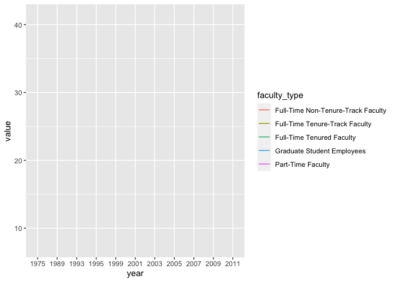
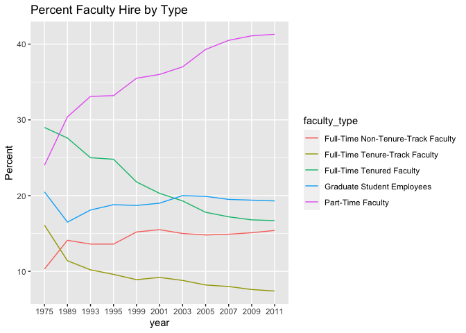
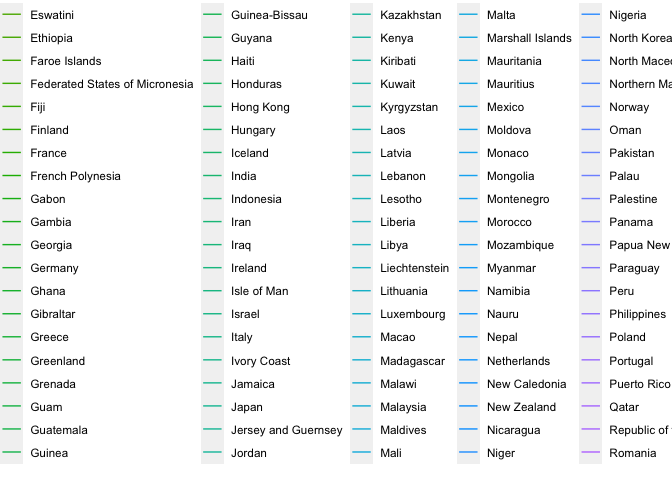

Lab 06 - Sad plots
================
Steph Bossert
16 Mar 21

### Load packages and data

``` r
library(tidyverse) 
library(dsbox) 
staff <- read_csv("data/instructional-staff.csv")
```

### Exercise 1

Thought exercise: There should be 55 rows…

``` r
staff_long <- staff %>%
  pivot_longer(cols = -faculty_type, names_to = "year") %>%
  mutate(value = as.numeric(value))
view(staff_long)
```

``` r
 staff_long %>%
  ggplot(aes(x = year, y = value, color = faculty_type)) +
  geom_line()
```

    ## geom_path: Each group consists of only one observation. Do you need to adjust
    ## the group aesthetic?

<!-- -->

``` r
staff_long %>%
  ggplot(aes(x = year, y = value, group = faculty_type, color = faculty_type)) +
  geom_line()+
  ggtitle("Percent Faculty Hire by Type") +
  ylab("Percent")
```

<!-- -->

``` r
fisheries <- read_csv("data/fisheries.csv")
```

    ## 
    ## ── Column specification ────────────────────────────────────────────────────────
    ## cols(
    ##   country = col_character(),
    ##   capture = col_double(),
    ##   aquaculture = col_double(),
    ##   total = col_double()
    ## )

``` r
fisheries %>%
  ggplot(aes(x = capture, y = total, color = country)) +
  geom_line()
```

<!-- -->

### Exercise 2

I would might create a different type of graph comparing the different
rates per year (combining the full time positions). I would then create
a bar graph, similar to lab 6A showing the differences in value
(percentage) \#\#\# Exercise 3 This is intense\! Lots of data. Because
there are so many countries, I think it’s hard to read the graph and
gain useful information. So, I would break the data down by country,
depending on values and then create different visualizations to
represent the data.

``` r
fisheries<- fisheries %>%
mutate(total_condition= case_when(total <= "250000" ~ "1",
                                  total> "250000" & total <= "500000" ~ "2",
                                  total> "500000" ~ "3"))
view(fisheries)
```

``` r
# based on variable values
Group_1 <- subset(fisheries, total_condition == "1")
Group_2 <- subset(fisheries, total_condition == "2")
Group_3 <- subset(fisheries, total_condition == "3")
view(Group_1)
view(Group_2)
view(Group_3)
```

``` r
ggplot(Group_1, aes(x="", y=total, fill=country)) +
  geom_bar(stat="identity", width=.1) +
  coord_polar("y", start=0)
```

<!-- -->

``` r
ggplot(Group_2, aes(x="", y=total, fill=country)) +
  geom_bar(stat="identity", width=.1) +
  coord_polar("y", start=0)
```

<!-- -->

``` r
ggplot(Group_3, aes(x="", y=total, fill=country)) +
  geom_bar(stat="identity", width=.1) +
  coord_polar("y", start=0)
```

<!-- --> \#\#\#Exercise 3
This of course would not work as a final product to fix the original
graph. Most of my changes are aspiration\! -I would create a larger
graph to display all the appropriately (by grouping) -Based on the three
groups, I would create these visualizations so that all the datapoints
can be observed clearly and concisely (not 5.0e + 07)
